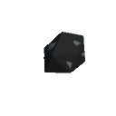

# Charcoal 合成方法

|1|2|3|
|----|-----|-----|
|Oak Wood|无|无|
|无|无|无|
|无|无|无|

是否需要加热: 是

生成 Charcoal \* 数量 1
      

|1|2|3|
|----|-----|-----|
|无|Oak Wood|无|
|无|无|无|
|无|无|无|

是否需要加热: 是

生成 Charcoal \* 数量 1
      

|1|2|3|
|----|-----|-----|
|无|无|Oak Wood|
|无|无|无|
|无|无|无|

是否需要加热: 是

生成 Charcoal \* 数量 1
      

|1|2|3|
|----|-----|-----|
|无|无|无|
|Oak Wood|无|无|
|无|无|无|

是否需要加热: 是

生成 Charcoal \* 数量 1
      

|1|2|3|
|----|-----|-----|
|无|无|无|
|无|Oak Wood|无|
|无|无|无|

是否需要加热: 是

生成 Charcoal \* 数量 1
      

|1|2|3|
|----|-----|-----|
|无|无|无|
|无|无|Oak Wood|
|无|无|无|

是否需要加热: 是

生成 Charcoal \* 数量 1
      

|1|2|3|
|----|-----|-----|
|无|无|无|
|无|无|无|
|Oak Wood|无|无|

是否需要加热: 是

生成 Charcoal \* 数量 1
      

|1|2|3|
|----|-----|-----|
|无|无|无|
|无|无|无|
|无|Oak Wood|无|

是否需要加热: 是

生成 Charcoal \* 数量 1
      

|1|2|3|
|----|-----|-----|
|无|无|无|
|无|无|无|
|无|无|Oak Wood|

是否需要加热: 是

生成 Charcoal \* 数量 1
      

