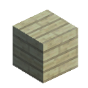

# Oak-Wood-Planks 合成方法

|1|2|3|
|----|-----|-----|
|Oak Wood|-|-|
|-|-|-|
|-|-|-|

是否需要加热: 否

生成 Oak Wood Planks \* 数量 4
      

|1|2|3|
|----|-----|-----|
|-|-|-|
|Oak Wood|-|-|
|-|-|-|

是否需要加热: 否

生成 Oak Wood Planks \* 数量 4
      

|1|2|3|
|----|-----|-----|
|-|-|-|
|-|-|-|
|Oak Wood|-|-|

是否需要加热: 否

生成 Oak Wood Planks \* 数量 4
      

|1|2|3|
|----|-----|-----|
|-|Oak Wood|-|
|-|-|-|
|-|-|-|

是否需要加热: 否

生成 Oak Wood Planks \* 数量 4
      

|1|2|3|
|----|-----|-----|
|-|-|-|
|-|Oak Wood|-|
|-|-|-|

是否需要加热: 否

生成 Oak Wood Planks \* 数量 4
      

|1|2|3|
|----|-----|-----|
|-|-|-|
|-|-|-|
|-|Oak Wood|-|

是否需要加热: 否

生成 Oak Wood Planks \* 数量 4
      

|1|2|3|
|----|-----|-----|
|-|-|Oak Wood|
|-|-|-|
|-|-|-|

是否需要加热: 否

生成 Oak Wood Planks \* 数量 4
      

|1|2|3|
|----|-----|-----|
|-|-|-|
|-|-|Oak Wood|
|-|-|-|

是否需要加热: 否

生成 Oak Wood Planks \* 数量 4
      

|1|2|3|
|----|-----|-----|
|-|-|-|
|-|-|-|
|-|-|Oak Wood|

是否需要加热: 否

生成 Oak Wood Planks \* 数量 4
      

