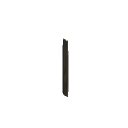

# Stick 合成方法

|1|2|3|
|----|-----|-----|
|Oak Wood Planks|无|无|
|Oak Wood Planks|无|无|
|无|无|无|

是否需要加热: 否

生成 Stick \* 数量 4
      

|1|2|3|
|----|-----|-----|
|无|无|无|
|Oak Wood Planks|无|无|
|Oak Wood Planks|无|无|

是否需要加热: 否

生成 Stick \* 数量 4
      

|1|2|3|
|----|-----|-----|
|无|Oak Wood Planks|无|
|无|Oak Wood Planks|无|
|无|无|无|

是否需要加热: 否

生成 Stick \* 数量 4
      

|1|2|3|
|----|-----|-----|
|无|无|无|
|无|Oak Wood Planks|无|
|无|Oak Wood Planks|无|

是否需要加热: 否

生成 Stick \* 数量 4
      

|1|2|3|
|----|-----|-----|
|无|无|Oak Wood Planks|
|无|无|Oak Wood Planks|
|无|无|无|

是否需要加热: 否

生成 Stick \* 数量 4
      

|1|2|3|
|----|-----|-----|
|无|无|无|
|无|无|Oak Wood Planks|
|无|无|Oak Wood Planks|

是否需要加热: 否

生成 Stick \* 数量 4
      

