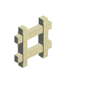

# Ladder 合成方法

|第一列|第二列|第三列|
|----|-----|-----|
|Oak Wood Planks|Stick|Oak Wood Planks|
|Oak Wood Planks|无|Oak Wood Planks|
|无|无|无|

是否需要加热: 否

生成 Ladder \* 数量 4
      

|第一列|第二列|第三列|
|----|-----|-----|
|Oak Wood Planks|Stick|Oak Wood Planks|
|Oak Wood Planks|无|Oak Wood Planks|
|Oak Wood Planks|Stick|Oak Wood Planks|

是否需要加热: 否

生成 Ladder \* 数量 4
      

