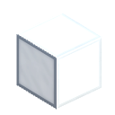

# White-Glass 合成方法

|第一列|第二列|第三列|
|----|-----|-----|
|Sand|无|无|
|无|无|无|
|无|无|无|

是否需要加热: 是

生成 White Glass \* 数量 4
      

|第一列|第二列|第三列|
|----|-----|-----|
|无|Sand|无|
|无|无|无|
|无|无|无|

是否需要加热: 是

生成 White Glass \* 数量 4
      

|第一列|第二列|第三列|
|----|-----|-----|
|无|无|Sand|
|无|无|无|
|无|无|无|

是否需要加热: 是

生成 White Glass \* 数量 4
      

|第一列|第二列|第三列|
|----|-----|-----|
|无|无|无|
|Sand|无|无|
|无|无|无|

是否需要加热: 是

生成 White Glass \* 数量 4
      

|第一列|第二列|第三列|
|----|-----|-----|
|无|无|无|
|无|Sand|无|
|无|无|无|

是否需要加热: 是

生成 White Glass \* 数量 4
      

|第一列|第二列|第三列|
|----|-----|-----|
|无|无|无|
|无|无|Sand|
|无|无|无|

是否需要加热: 是

生成 White Glass \* 数量 4
      

|第一列|第二列|第三列|
|----|-----|-----|
|无|无|无|
|无|无|无|
|Sand|无|无|

是否需要加热: 是

生成 White Glass \* 数量 4
      

|第一列|第二列|第三列|
|----|-----|-----|
|无|无|无|
|无|无|无|
|无|Sand|无|

是否需要加热: 是

生成 White Glass \* 数量 4
      

|第一列|第二列|第三列|
|----|-----|-----|
|无|无|无|
|无|无|无|
|无|无|Sand|

是否需要加热: 是

生成 White Glass \* 数量 4
      

